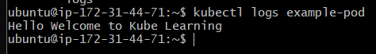

# Kubernetes Configuration Examples

This repository contains examples of various Kubernetes configurations to demonstrate Pods, ConfigMaps, Jobs, and multi-container setups.

## Table of Contents
- [Simple Pod](#simple-pod)
- [ConfigMap Example](#configmap-example)
- [Job](#job)
- [Pod with Init Container](#pod-with-init-container)
- [Pod with Multiple Init Containers](#pod-with-multiple-init-containers)
- [Services](#services)
- [Multi-Container Pod](#multi-container-pod)

## Simple Pod
A basic Pod running an Ubuntu container with a simple command and arguments.
```yaml
apiVersion: v1
kind: Pod
metadata:
  name: example-pod
  labels:
    purpose: demonstrate-args
spec:
  containers:
  - name: example-container
    image: ubuntu
    command: ["/bin/echo", "Hello"]  
    args: ["Welcome", "to", "Kube Learning"]

## To run -> kubectl create -f  first.yaml and kubectl apply name.yaml
## Remember only once we can create but can apply many times.



ConfigMap Example
A ConfigMap with folded multi-line data.

yaml
Copy code
apiVersion: v1
kind: ConfigMap
metadata:
  name: example-configmap-folded
data:
  mymessage: >
    Hello, this is a folded
    multi-line message.
Job
A Job running an nginx container that sleeps for 5 seconds with a backoff limit of 4.

yaml
Copy code
apiVersion: batch/v1
kind: Job
metadata:
  name: nginx-job
spec:
  template:
    spec:
      containers:
      - name: nginx
        image: nginx
        command: ["sleep", "5"]  
      restartPolicy: OnFailure  
  backoffLimit: 4 
Pod with Init Container
A Pod with an init container that downloads a webpage before starting the main nginx container.

yaml
Copy code
apiVersion: v1
kind: Pod
metadata:
  name: bootcamp-pod
spec:
  volumes:
  - name: shared-data
    emptyDir: {}
  initContainers:
  - name: bootcamp-init
    image: busybox
    command: ['sh', '-c', 'wget -O /usr/share/data/index.html http://kubesimplify.com']
    volumeMounts:
    - name: shared-data
      mountPath: /usr/share/data
  containers:
  - name: nginx
    image: nginx
    volumeMounts:
    - name: shared-data
      mountPath: /usr/share/nginx/html
Pod with Multiple Init Containers
A Pod with multiple init containers ensuring that services are available before starting the main container.

yaml
Copy code
apiVersion: v1
kind: Pod
metadata:
  name: init-demo-2
spec:
  initContainers:
  - name: check-db-service
    image: busybox
    command: ['sh', '-c', 'until nslookup db.default.svc.cluster.local; do echo waiting for db service; sleep 2; done;']
  - name: check-myservice
    image: busybox
    command: ['sh', '-c', 'until nslookup myservice.default.svc.cluster.local; do echo waiting for db service; sleep 2; done;']
  containers:
  - name: main-container
    image: busybox
    command: ['sleep', '3600']
Services
Services to expose db and myservice with specific ports.

yaml
Copy code
---
apiVersion: v1
kind: Service
metadata:
  name: db
spec:
  selector:
    app: demo1
  ports:
  - protocol: TCP
    port: 3306
    targetPort: 3306
---
apiVersion: v1
kind: Service
metadata:
  name: myservice
spec:
  selector:
    app: demo2
  ports:
  - protocol: TCP
    port: 80
    targetPort: 80
Multi-Container Pod
A multi-container Pod sharing a volume between containers.

yaml
Copy code
apiVersion: v1
kind: Pod
metadata:
  name: multi-container-pod
spec:
  volumes:
  - name: shared-data
    emptyDir: {}
  initContainers:
  - name: meminfo-container
    image: alpine
    restartPolicy: Always
    command: ['sh', '-c', 'sleep 5; while true; do cat /proc/meminfo > /usr/share/data/index.html; sleep 10; done;']
    volumeMounts:
    - name: shared-data
      mountPath: /usr/share/data
  containers:
  - name: nginx-container
    image: nginx
    volumeMounts:
    - name: shared-data
      mountPath: /usr/share/nginx/html
